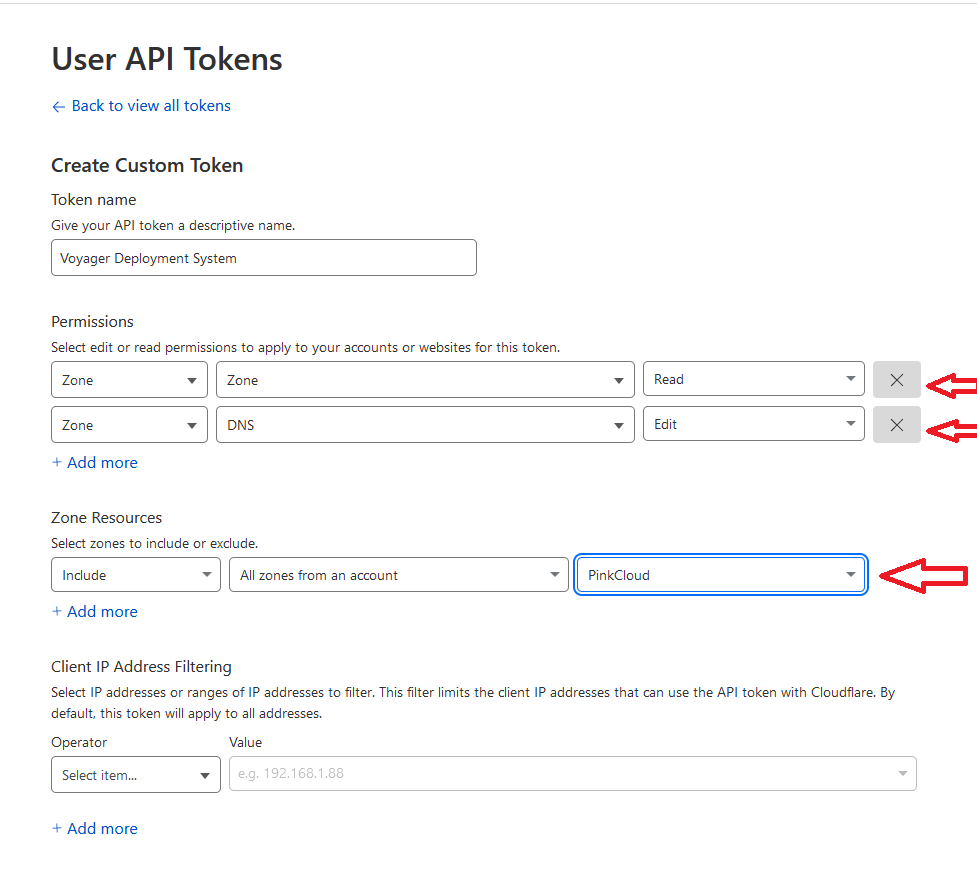
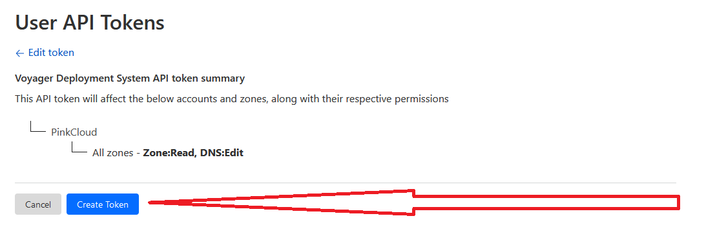

# Cloudflare

## Creating an API 

1. Go to https://dash.cloudflare.com/profile/api-tokens

2. Navigate to API Tokens Section
 

3. Click on Create Token
 

4. Click on Create Custom Token
 

5. Give the token a name and select the permissions from the images below.
 

6. Click on Continue to Summary
 

7. Store the token somewhere safe. You will not be able to see it again.