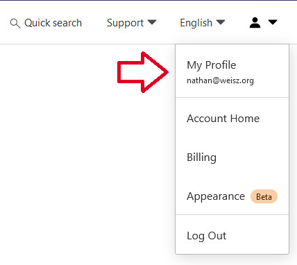
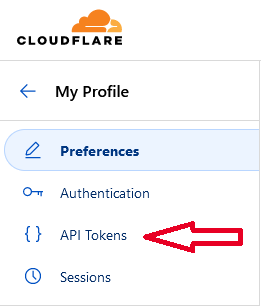
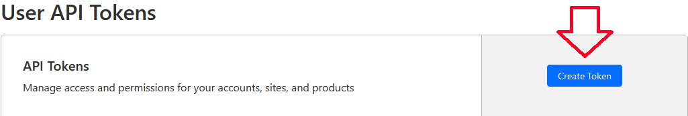
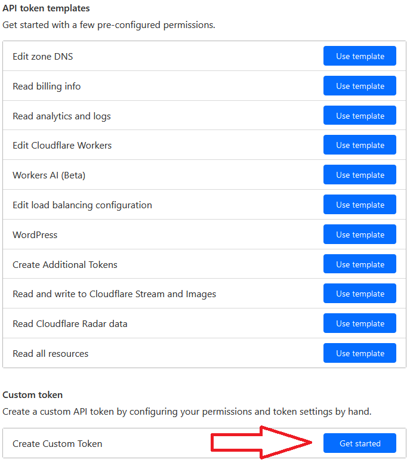

# Cloudflare

<h1>Cloudflare API Token Creation</h1>

<ol>
<li>
  
Go to <a href="https://dash.cloudflare.com/profile/api-tokens" target="_blank">https://dash.cloudflare.com/profile/api-tokens</a>

  
</li>

<li>
  
Navigate to the API Tokens Section

  
</li>

<li>
  
Click on Create Token

  
</li>

<li>
  
Click on Create Custom Token

  
</li>

<li>
  
Give the token a name and select the permissions from the images below

  
</li>

<li>
  
Click on Continue to Summary

  
</li>

<li>
  
Store the token somewhere safe. You will not be able to see it again.

</li>
</ol>